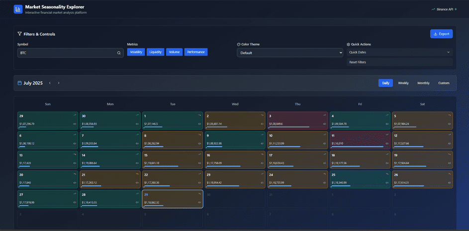
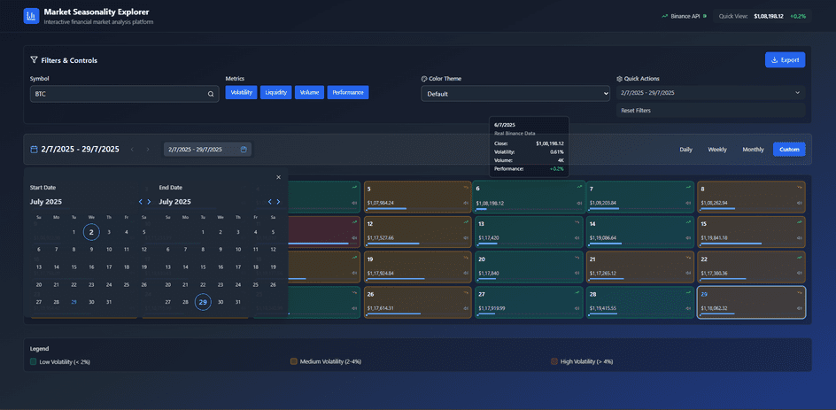
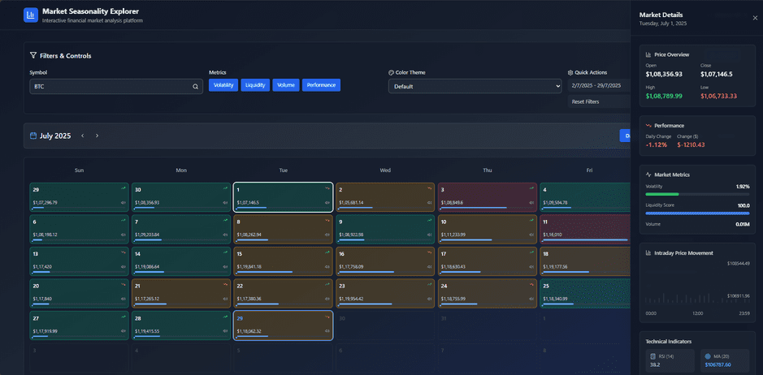

# Market Seasonality Explorer

> Market Seasonality Explorer is a responsive, real-time crypto analytics dashboard that visualizes market performance through a dynamic calendar interface. Each calendar cell represents a day/week/month and provides detailed insights such as volume, performance, volatility, and other technical metrics. Users can click on any day to access a comprehensive drill-down report with historical trends, comparative analysis, and visual breakdowns. The app supports live data updates, dark/light themes, and seamless interaction across desktop and mobile devices.

## Preview:







## Built With

- JavaScript
- TypeScript
- React
- Redux Toolkit
- Jest
- Tailwind CSS

## Libraries Used
- React: Core UI library for building components.
- Redux Toolkit: Simplified state management.
- React-Redux: React bindings for Redux.
- Jest: Testing framework.
- React Testing Library: Utilities for testing UI interactions.
- Vite: Fast build and development server.
- Tailwind CSS: Utility-first CSS framework for rapid UI development.
- Lucide React: Icon set for React.
- React Day Picker: Accessible date picker component.
- jsPDF: Client-side PDF generation.
- Redux Mock Store: For mocking Redux stores in tests.

For a complete list, check the package.json file

## Assumptions Made

- The app requires an active internet connection to fetch live crypto data.
- Users are expected to interact with the dashboard using modern browsers that support ES modules.
- Data is expected to be available and structured in a format consumable by the charting and calendar logic.
- All styling is done using Tailwind CSS and assumes no external CSS frameworks will be mixed in.
- Testing assumes the DOM is simulated using jsdom through Jest.
- All dates and times are handled in the user’s local timezone unless explicitly set otherwise.

## Live version

[Market Seasonality Explorer](https://market-explorer.thecodechaser.com)

## Getting Started

To get a local copy up and running follow these simple example steps.

### Prerequisites
- A text editor(preferably Visual Studio Code)
- Node
- Web browser

### Install
- [Git](https://git-scm.com/downloads)
- [Node](https://nodejs.org/en/download/)

### Using it Locally

- Clone the project

```bash 
git clone git@github.com:thecodechaser/market-seasonality-explorer.git

cd market-seasonality-explorer
```

- Install dependencies

```bash
npm i 
or
npm install
```
- To Start the development server
```bash
npm run dev
```

- To test the project
```bash
npm run test
```


## Visit And Open Files

[Visit Repo](https://github.com/thecodechaser/market-seasonality-explorer)

## Download Repo

[Download Repo](https://github.com/thecodechaser/market-seasonality-explorer/archive/refs/heads/main.zip)

## Authors

👤 **Ranjeet Singh**

- Website: [thecodechaser.com](https://thecodechaser.com)
- GitHub: [@thecodechaser](https://github.com/thecodechaser)
- Twitter: [@thecodechaser](https://twitter.com/thecodechaser)
- LinkedIn: [thecodechaser](https://linkedin.com/in/thecodechaser)

## 🤝 Contributing

Contributions, issues, and feature requests are welcome!

Feel free to check the [issues page](https://github.com/thecodechaser/market-seasonality-explorer/issues).

## Show your support

Give a ⭐️ if you like this project!

## Acknowledgments

- Inspiration: GoQuant

## 📝 License

This project is [MIT](./LICENSE) licensed.
